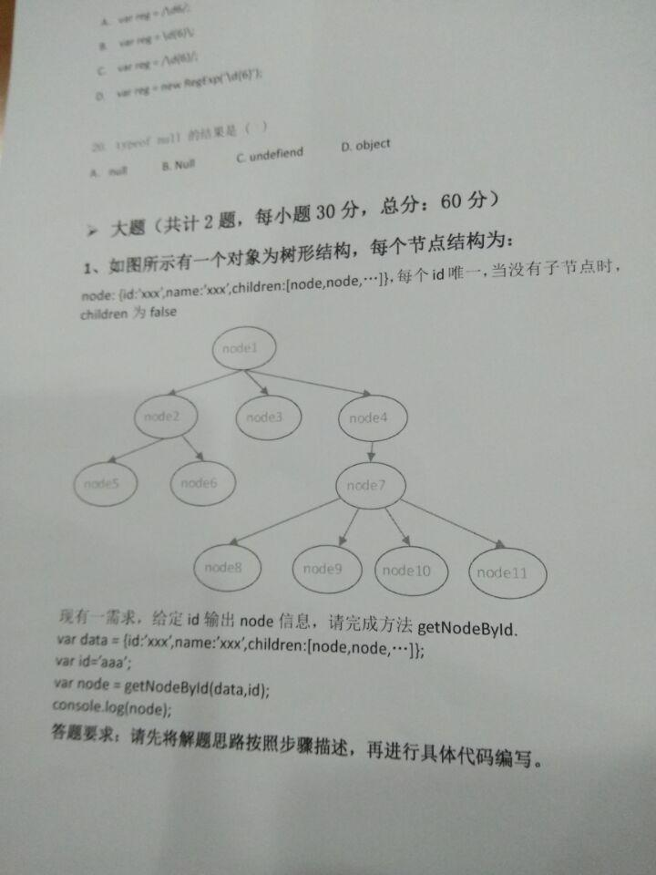

### 1. js 函数 split(), join()的区别.

```js
const str = 'foo bar baz';
const arr = str.split(' ');
// arr = ['foo', 'bar', 'baz'];

const str2 = arr.join('|');
// str2 = 'foo|bar|baz'
```


### 2. 递归算法




```js
function getNodById(data, id) {
    if (data.id === id) {
        return data;
    } else if(data.children !== false){
        var children = data.children;
        var childrenLen = children.length
        var result = false;
        for(var i = 0; i < childrenLen; i++) {
            var itemData = children[i];
            var itemResult = getNodById(itemData, id);
            if (itemResult !== false) {
                result = itemResult;
                break;
            }
        }

        return result;
    } else {
        return false;
    }
}
```

es6 版本
```js
function getNodById(data, id) {
    if (data.id === id) {
        return data;
    } else if(data.children !== false){
        let children = data.children;
        let result = false
        children.map((item) => {
            const itemResult = getNodById(item, id);
            if (!!itemResult) {
                result = itemResult
            }
        });

        return result;
    } else {
        return false;
    }
}
```

> 测试 data
```js
{
    id: '1',
    name: 'node1',
    children: [
        {
            id: '2',
            name: 'node2',
            children: [
                {
                    id: '3',
                    name: 'node3',
                    children: false
                },
                {
                    id: '4',
                    name: 'node4',
                    children: false
                }
            ],
        },
        {
            id: '5',
            name: 'node5',
            children: false
        },
        {
            id: '6',
            name: 'node6',
            children: false
        }
    ]
}
```


### javascript中replace( )

```js
(function (window) {
  function fn(str) {
    this.str = str;
  }
  fn.prototype.format = function () {
    var arg = ______;
    return this.str.replace(_______, function (a, b) {
      return arg[b] || '';
    });
  }
  window.fn = fn;
})(window);
// use
(function(){
  var t = new fn('<p><a href="{0}">{1}</a><span>{2}</span></p>');
  console.log( t.format('http://www.alibaba.com', 'Alibaba', 'Welcome') );
})();
```

> 回答:

1. var arg=Array.prototype.slice.call(arguments,0);
    * arguments 不是真实数组


参考:
```js
var pattern=/8(.*)8/;
var str='This is a 8baidu8';
document.write(str.replace(pattern,'<strong>$1</strong>'));
```
